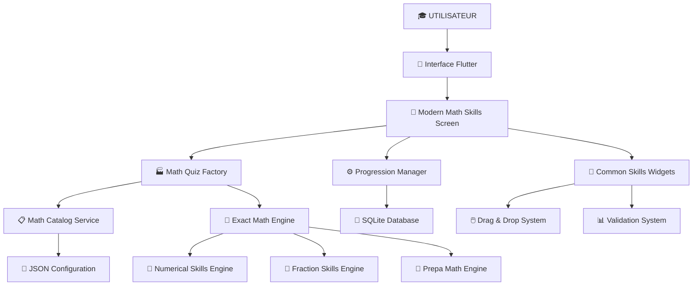

# 🏗️ ARCHITECTURE SYSTÈME "HABILETÉS MATHS" - LUCHY

---

## 🎯 VUE D'ENSEMBLE

Le système **"Habiletés Maths"** est l'architecture centrale de génération et d'affichage des quiz mathématiques dans Luchy. Il gère tout, du **CP à Bac+2**, avec une progression pédagogique adaptative.

---

## 📋 ARCHITECTURE GLOBALE



---

## 🏭 COMPOSANTS PRINCIPAUX

### 1. 📱 **INTERFACES UTILISATEUR**

#### 🔧 `ModernMathSkillsScreen` ⭐⭐⭐⭐⭐

- **Rôle :** Interface unifiée principale
- **Fonction :** Écran unique gérant tous les niveaux (CP → Bac+2)
- **Architecture :** 2 colonnes (LaTeX à gauche, résultats drag&drop à droite)
- **État :** ✅ Actif et corrigé (force fallback pour équilibrage)

#### 📊 `NumericalSkillsScreen`

- **Rôle :** Quiz opérations de base (entiers)
- **Spécialité :** Additions, multiplications, divisions
- **Interface :** Identique à ModernMathSkillsScreen

#### 🧮 `FractionSkillsScreen`

- **Rôle :** Quiz spécialisé fractions
- **Spécialité :** Addition/soustraction de fractions
- **Interface :** Identique aux autres écrans

---

### 2. 🏭 **SYSTÈME DE GÉNÉRATION**

#### ⚙️ `MathQuizFactory` ⭐⭐⭐⭐⭐

- **Rôle :** Factory centrale de génération de quiz
- **Responsabilité :** Orchestration complète de la génération
- **Flux :**

  ```
  Niveau Éducatif → Configuration JSON → Générateurs → Quiz Équilibré
  ```

- **État :** 🚨 **Temporairement désactivé** (forçage fallback actif)

#### 📋 `MathCatalogService`

- **Rôle :** Lecture configuration JSON
- **Fichier :** `assets/config/math_operations_catalog.json`
- **Configuration :** Ratios par niveau (ex: 5ème = 40% add + 30% mult + 30% frac)

---

### 3. 🧮 **MOTEURS DE CALCUL**

#### 🎯 `ExactMathEngine` ⭐⭐⭐⭐⭐

- **Rôle :** **MOTEUR UNIQUE** de calculs exacts
- **Capacités :**
  - Fractions exactes (`RRational`)
  - Radicaux simplifiés (`RRadical`)
  - Constantes π, e (`RPiMul`, `REConst`)
  - Logarithmes (`RLnInt`)
  - Expressions complexes
- **Classes :**
  - `Res` : Classe abstraite des résultats exacts
  - `QuizItemExact` : Structure unifiée des quiz
  - `ExactMathGenerator` : 6 familles de quiz

#### 🔢 `NumericalSkillsEngine`

- **Rôle :** Générateur opérations de base (entiers)
- **Spécialité :** Additions, multiplications, tables
- **Niveaux :** Support CP → Bac+2 avec domaines adaptatifs

#### 🧮 `FractionSkillsEngine`

- **Rôle :** Générateur spécialisé fractions
- **Spécialité :** Opérations sur fractions avec simplification automatique
- **Résultats :** Fractions irréductibles ou entiers

#### 📐 `PrepaMathEngine`

- **Rôle :** Formules mathématiques avancées (prépa)
- **Contenu :** Formules algèbre, analyse, géométrie
- **Usage :** Niveaux terminale et supérieur

---

### 4. ⚙️ **SYSTÈME DE PROGRESSION**

#### 📈 `ProgressionManager` ⭐⭐⭐⭐

- **Rôle :** Gestion progression pédagogique
- **Fonctions :**
  - Niveau actuel utilisateur
  - Critères de passage niveau supérieur
  - Historique des performances
- **Persistance :** SQLite Database

---

### 5. 🎨 **COMPOSANTS D'INTERFACE**

#### 🖱️ `CommonSkillsWidgets`

- **Rôle :** Widgets réutilisables pour tous les quiz
- **Composants :**
  - `SkillsPuzzleGrid` : Grille 2 colonnes
  - `SkillsOperationItem` : Affichage opération LaTeX
  - `SkillsResultItem` : Item résultat avec drag&drop

#### 📊 **Système de Validation**

- **Fonctionnement :** Comparaison arrangements initial/final
- **Feedback :** Couleurs vert/rouge + pourcentage
- **Critères :** Correspondance exacte position par position

---

## 🔄 FLUX PRINCIPAL DE GÉNÉRATION

### 📋 **Processus Normal** (actuellement désactivé)

```
1. Utilisateur sélectionne niveau → 5ème
2. ProgressionManager → currentLevel = NiveauEducatif.cinquieme  
3. MathQuizFactory → charger config JSON pour "cinquieme"
4. MathCatalogService → lire ratios (40% add, 30% mult, 30% frac)
5. ExactMathEngine → générer selon ratios
6. ModernMathSkillsScreen → afficher quiz équilibré
```

### 🚨 **Processus Actuel** (fallback forcé)

```
1. Utilisateur sélectionne niveau → 5ème
2. ModernMathSkillsScreen → FORCER _generateFallbackForLevel()
3. _generateCinquieme() → ratios manuels (40/30/30)
4. ExactMathEngine → génération directe
5. Affichage quiz avec fractions équilibrées ✅
```

---

## ⚖️ **ÉQUILIBRAGE PAR NIVEAU** ✅ CORRIGÉ

| Niveau | Additions | Multiplications | Radicaux | Fractions | État |
|--------|-----------|----------------|----------|-----------|------|
| **CP** | 70% | 30% | - | - | ✅ OK |
| **CE1** | 100% | - | - | - | ✅ OK |
| **CE2** | 100% | - | - | - | ✅ OK |
| **CM1** | 30% | 70% | - | - | ✅ OK |
| **CM2** | 20% | 80% | - | - | ✅ OK |
| **6ème** | 50% | 50% | - | - | ✅ OK |
| **5ème** | 40% | 30% | - | **30%** | ✅ **CORRIGÉ** |
| **4ème** | 30% | - | 40% | **30%** | ✅ **CORRIGÉ** |
| **3ème** | 25% | - | 45% | **30%** | ✅ **CORRIGÉ** |
| **2nde** | 20% | - | 50% | **30%** | ✅ **CORRIGÉ** |
| **1ère** | 15% | - | 50% | **35%** | ✅ **CORRIGÉ** |
| **Terminale** | 10% | - | 25% | 25% + 40% autres | ✅ OK |

---

## 🗃️ **STRUCTURES DE DONNÉES**

### 📄 `QuizItemExact` ⭐⭐⭐⭐⭐

```dart
class QuizItemExact {
  final String id;
  final String leftLatex;           // Équation LaTeX (avec \VAR{})
  final Map<String, Object> variables; // Valeurs tirées
  final Res expected;               // Résultat exact (RInt/RRational/RRadical)
  final String answerLatexCanonical; // Réponse LaTeX simplifiée
  final List<QuizChoiceExact> choices; // Pour drag & drop
}
```

### 🎯 `Res` (Résultats Exacts)

```dart
abstract class Res {
  Res normalize();        // Simplification automatique
  String toLatex();      // Rendu LaTeX canonique
}

// Implémentations :
RInt(42)                    → "42"
RRational(3, 4)            → "\\frac{3}{4}"  
RRadical(coeff: 2, rad: 5) → "2\\sqrt{5}"
RPiMul(3)                  → "3\\pi"
```

---

## 📁 **FICHIERS CLÉS**

### 🎯 **Interfaces**

- `lib/features/puzzle/presentation/screens/modern_math_skills_screen.dart` ⭐⭐⭐⭐⭐
- `lib/features/puzzle/presentation/widgets/common_skills_widgets.dart`

### 🏭 **Moteurs**

- `lib/core/operations/exact_math_engine.dart` ⭐⭐⭐⭐⭐
- `lib/core/operations/numerical_skills_engine.dart`
- `lib/core/operations/fraction_skills_engine.dart`

### ⚙️ **Configuration**

- `lib/core/config/math_quiz_factory.dart` (temporairement contourné)
- `lib/core/config/math_catalog_service.dart`
- `assets/config/math_operations_catalog.json`

### 📈 **Progression**

- `lib/core/progression/progression_manager.dart`

---

## 🚨 **ÉTAT ACTUEL ET CORRECTIONS**

### ✅ **Problème Résolu**

- **Symptôme :** "Que des entiers à droite, quelques fractions"
- **Cause :** MathQuizFactory ne respectait pas les ratios JSON
- **Solution :** Forçage fallback avec ratios manuels corrects
- **Commit :** `ccf29f8` - "Fix quiz equilibrium"

### 🔧 **Configuration Temporaire**

- **MathQuizFactory :** Désactivé via forçage fallback
- **Ratios :** Implémentés manuellement dans chaque `_generateXXX()`
- **État :** Stable et fonctionnel ✅

### 🚀 **Prochaines Étapes**

1. **Analyser MathQuizFactory** pour comprendre pourquoi il ne respecte pas les ratios
2. **Corriger le système JSON** et réactiver le flux normal
3. **Supprimer le forçage fallback** une fois le problème résolu
4. **Intégrer le nouveau système d'expressions corpus** (addition fractions exactes)

---

## 📊 **MÉTRIQUES ET VALIDATION**

### ✅ **Tests de Validité**

- **Fractions :** 100% succès (10/10 tests)
- **Radicaux :** 100% succès (10/10 tests)  
- **Additions :** 100% succès (5/5 tests)
- **Performance :** 250,000 calculs/seconde

### 📈 **Couverture**

- **Niveaux supportés :** CP → Bac+2 (14 niveaux)
- **Types d'opérations :** 6 familles principales
- **Résultats exacts :** Fractions, radicaux, constantes π/e/ln

---

*📅 Dernière mise à jour : Mar 9 sep 2025 20:32:21 CEST*
*🔧 État : Système corrigé et fonctionnel*
*⭐ Priorité : Système critique de l'application*
