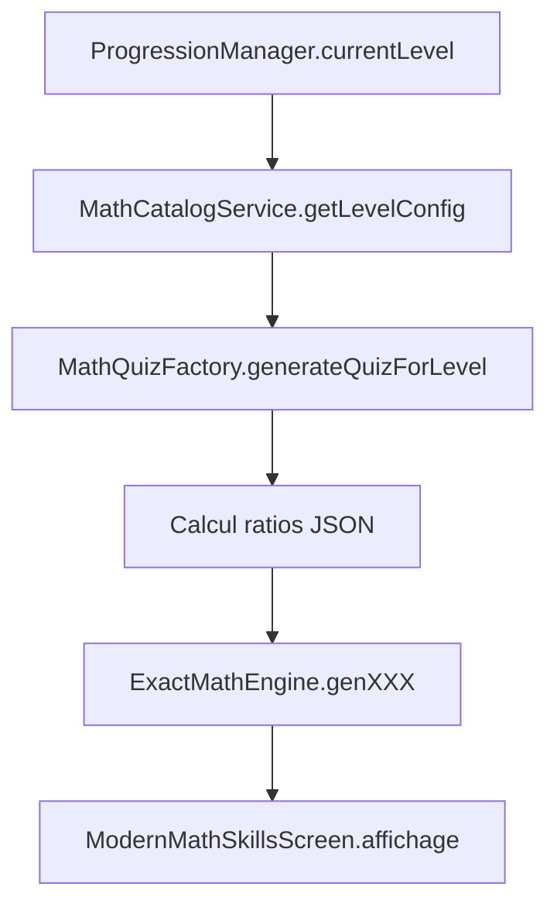
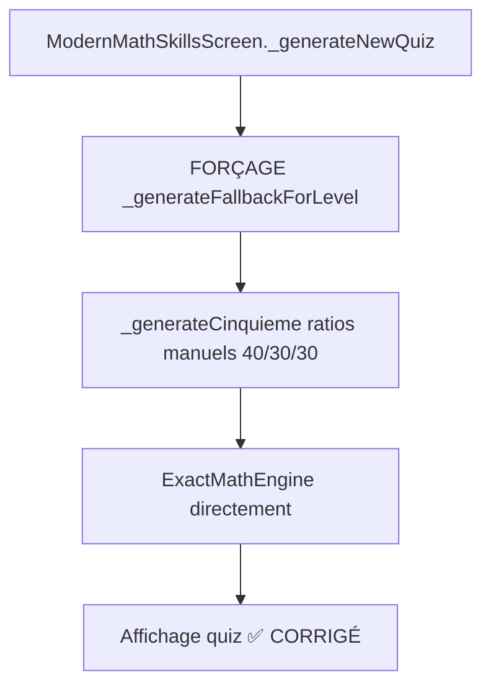

# 📦 COMPOSANTS SYSTÈME "HABILETÉS MATHS" - DOCUMENTATION TECHNIQUE

*Document de référence maintenu à jour lors des modifications majeures*

---

## 🎯 **VUE D'ENSEMBLE DU SYSTÈME**

Le système "Habiletés Maths" est l'architecture centrale de Luchy pour les quiz mathématiques éducatifs. Il gère **14 niveaux** (CP → Bac+2) avec une progression pédagogique adaptative et des calculs mathématiques exacts.

**📅 Dernière mise à jour :** Mar 9 sep 2025 20:45:00 CEST  
**🔧 État actuel :** Système corrigé et fonctionnel (fallback actif)  
**⭐ Priorité :** Critique (cœur de l'application éducative)

---

## 📦 **COMPOSANTS DART - COUCHE PRÉSENTATION**

### 🖥️ **ÉCRANS D'INTERFACE**

#### 🔧 `ModernMathSkillsScreen` ⭐⭐⭐⭐⭐
**Fichier :** `lib/features/puzzle/presentation/screens/modern_math_skills_screen.dart`

```dart
Role: Interface unifiée principale pour tous les niveaux éducatifs
```

**🎯 Responsabilités :**
- **📱 Interface :** Grille 2 colonnes (LaTeX gauche 2/3 + drag&drop droite 1/3)
- **🔄 Orchestration :** Coordination `ProgressionManager` + `ExactMathEngine`
- **📊 Génération :** Appels aux générateurs par niveau avec système fallback
- **✅ Validation :** Couleurs vert/rouge + pourcentage de réussite
- **📈 État :** Gestion `List<QuizItemExact> _operations`, `List<String> _results`

**🔧 Méthodes clés :**
- `_generateNewQuiz()` → Orchestration génération avec anti-doublons
- `_generateOperationsForLevel(niveau)` → Dispatch par niveau éducatif
- `_generateFallbackForLevel()` → **ACTUEL** fallback avec ratios manuels
- `_checkResults()` → Validation et calcul pourcentage
- `_showProgressionDialog()` → Feedback progression utilisateur

**🚨 État actuel :** FORÇAGE fallback actif pour contourner problème `MathQuizFactory`

#### 📊 `NumericalSkillsScreen`
**Fichier :** `lib/features/puzzle/presentation/screens/numerical_skills_screen.dart`

```dart
Role: Quiz spécialisé opérations entières de base
```

**🎯 Spécialités :**
- **🔢 Opérations :** Additions, multiplications, divisions
- **📊 Résultats :** Entiers uniquement (pas de fractions)
- **🎨 Interface :** Clone identique de `ModernMathSkillsScreen`

#### 🧮 `FractionSkillsScreen`
**Fichier :** `lib/features/puzzle/presentation/screens/fraction_skills_screen.dart`

```dart
Role: Quiz spécialisé fractions pures
```

**🎯 Spécialités :**
- **🧮 Opérations :** Addition/soustraction de fractions
- **📊 Résultats :** Fractions irréductibles ou entiers
- **🎨 Interface :** Clone identique de `ModernMathSkillsScreen`

---

## 🏭 **COMPOSANTS DART - COUCHE MÉTIER**

### 🎯 `ExactMathEngine` ⭐⭐⭐⭐⭐
**Fichier :** `lib/core/operations/exact_math_engine.dart`

```dart
Role: MOTEUR UNIQUE de calculs mathématiques exacts
```

**🧮 Classes de résultats (`Res`) :**
```dart
abstract class Res {
  Res normalize();     // Simplification automatique
  String toLatex();    // Rendu LaTeX canonique
}

// Implémentations :
RInt(42)                    → "42"
RRational(3, 4)            → "\\frac{3}{4}"  
RRadical(coeff: 2, rad: 5) → "2\\sqrt{5}"
RPiMul(3)                  → "3\\pi"
REConst(e)                 → "e"
RLnInt(5)                  → "\\ln(5)"
```

**🏭 Générateurs principaux :**
- `genCPAddition()` → Niveau CP spécifique (1-4, 6 questions)
- `genProgressiveAddition(level)` → Additions adaptatives par niveau
- `genDynamicMultiplication(tables)` → Tables configurables (0-9, 25, 50, 75, 100)
- `genFractionSum()` → Additions fractions exactes avec simplification
- `genRadicalSum()` → Radicaux simplifiés avec extraction carrés parfaits
- `genPiOperations()` → Constantes π, e avec opérations
- `genLogExpOperations()` → Logarithmes et exponentielles

**🔧 Structures de données :**
```dart
class QuizItemExact {
  final String id;
  final String leftLatex;           // Équation LaTeX (avec \VAR{})
  final Map<String, Object> variables; // Valeurs substituées
  final Res expected;               // Résultat exact
  final String answerLatexCanonical; // Réponse LaTeX simplifiée
  final List<QuizChoiceExact> choices; // Pour drag & drop
}
```

### 🔢 `NumericalSkillsEngine`
**Fichier :** `lib/core/operations/numerical_skills_engine.dart`

```dart
Role: Générateur spécialisé opérations entières
```

**🎯 Capacités :**
- **📊 Types :** Carrés, racines entières, factorielles, combinaisons
- **📈 Adaptation :** 14 niveaux avec domaines numériques adaptés
- **🔢 Résultats :** Entiers uniquement (validation `result is int`)

### 🧮 `FractionSkillsEngine`
**Fichier :** `lib/core/operations/fraction_skills_engine.dart`

```dart
Role: Générateur spécialisé fractions pures
```

**🎯 Capacités :**
- **🧮 Opérations :** Addition, soustraction, multiplication, division
- **📊 Simplification :** Fractions automatiquement réduites
- **📈 Niveaux :** 3 niveaux de difficulté (Facile/Moyen/Difficile)

### 📐 `PrepaMathEngine`
**Fichier :** `lib/core/formulas/prepa_math_engine.dart`

```dart
Role: Formules mathématiques avancées (niveaux supérieurs)
```

**📚 Contenu :**
- **🗃️ Base :** `allFormulas` avec métadonnées chapitre/niveau
- **🎓 Usage :** Terminale, Bac+1, Bac+2
- **🔍 Accès :** `getFormulasByChapter()`, `getFormulasByLevel()`
- **📖 Domaines :** Algèbre, analyse, géométrie, probabilités

---

## ⚙️ **COMPOSANTS DART - COUCHE CONFIGURATION**

### 🏭 `MathQuizFactory` ⭐⭐⭐⭐ 
**Fichier :** `lib/core/config/math_quiz_factory.dart`

```dart
Role: Factory centrale orchestrant génération selon configuration JSON
```

**🔄 Workflow théorique :**
```
Niveau éducatif → Configuration JSON → Calcul ratios → ExactMathEngine → Quiz équilibré
```

**🚨 État actuel :** **CONTOURNÉ** via forçage fallback
**🔧 Raison :** Ne respectait pas les ratios JSON définis
**💡 Solution temporaire :** Ratios manuels dans `_generateFallbackForLevel()`

### 📋 `MathCatalogService`
**Fichier :** `lib/core/config/math_catalog_service.dart`

```dart
Role: Service lecture et interprétation configuration JSON
```

**📄 Fonctions :**
- `loadCatalog()` → Lecture `assets/config/math_operations_catalog.json`
- `getLevelConfig(niveau)` → Configuration niveau spécifique
- `getOperationConfig(operation)` → Paramètres opération
- `validateConfiguration()` → Vérification cohérence JSON

**🎯 Modèles de données :**
```dart
class OperationConfig {
  final String availableFrom;
  final Map<String, dynamic> domainsByLevel;
  final String generatorMethod;
  final Map<String, dynamic> parameters;
}

class LevelConfig {
  final List<String> operations;
  final Map<String, int> mixRatio;
  final int totalQuestions;
  final String description;
}
```

---

## 📈 **COMPOSANTS DART - COUCHE PROGRESSION**

### 📊 `ProgressionManager`
**Fichier :** `lib/core/progression/progression_manager.dart`

```dart
Role: Gestion progression pédagogique utilisateur
```

**📈 État utilisateur :**
```dart
class ProgressionState {
  final NiveauEducatif currentLevel;
  final int redoublementCount;
  final int totalQuizzes;
  final int successfulQuizzes;
  final DateTime lastQuizDate;
}
```

**✅ Système de validation :**
```dart
enum ValidationResult {
  promoted,    // Passage niveau supérieur
  redoublement, // Répétition niveau actuel
  demoted      // Retour niveau inférieur
}

ValidationResult validateQuiz(int correctAnswers, int totalQuestions);
```

**💾 Persistance :** SQLite via `DatabaseService`

---

## 🎨 **COMPOSANTS DART - COUCHE WIDGETS**

### 🖱️ `CommonSkillsWidgets`
**Fichier :** `lib/features/puzzle/presentation/widgets/common_skills_widgets.dart`

```dart
Role: Widgets réutilisables pour tous les quiz
```

**🧩 Composants :**
- **📊 `SkillsPuzzleGrid`** → Grille 2 colonnes standardisée
- **🧮 `SkillsOperationItem`** → Affichage LaTeX opération (colonne gauche)
- **🎯 `SkillsResultItem`** → Item résultat avec drag&drop (colonne droite)
- **✅ `ValidationIndicator`** → Bordures vert/rouge selon correctness
- **📊 `ProgressIndicator`** → Barre progression quiz

---

## 📄 **CONFIGURATION JSON**

### 🗃️ `math_operations_catalog.json` ⭐⭐⭐⭐⭐
**Fichier :** `assets/config/math_operations_catalog.json`

```json
Role: Configuration externe complète du système pédagogique
```

#### 🏗️ **Structure générale :**
```json
{
  "metadata": {
    "version": "1.0.0",
    "description": "Catalogue des opérations mathématiques par niveau éducatif",
    "last_updated": "2025-03-09"
  },
  "operations": {
    // 6 opérations configurées avec paramètres détaillés
  },
  "level_configurations": {
    // 14 niveaux CP → Bac+2 avec ratios de mélange
  }
}
```

#### ⚙️ **Section `operations` - 6 opérations :**

**1. 🔢 Addition :**
```json
"addition": {
  "available_from": "cp",
  "domains_by_level": {
    "cp": {"min": 1, "max": 4},
    "sixieme": {"min": 1, "max": 20},
    "terminale": {"min": 1, "max": 100}
  },
  "generator_method": "genProgressiveAddition",
  "parameters": {
    "numberOfResults": 5,
    "distractors": ["plus_one", "minus_one", "multiplication_confusion"]
  }
}
```

**2. ✖️ Multiplication :**
```json
"multiplication": {
  "available_from": "cp",
  "domains_by_level": {
    "cp": {"tables": [0, 1, 2]},
    "cm2": {"tables": [1, 2, 3, 4, 5, 6, 7, 8, 9]},
    "seconde": {"tables": [1, 2, 3, 4, 5, 6, 7, 8, 9, 10, 25, 50, 75, 100]}
  },
  "generator_method": "genDynamicMultiplication"
}
```

**3. 🔷 Radicaux :**
```json
"radicals": {
  "available_from": "quatrieme",
  "domains_by_level": {
    "quatrieme": {"range": [1, 25], "operations": ["simplification", "sum"]},
    "terminale": {"range": [1, 200], "operations": ["simplification", "sum", "product", "division"]}
  },
  "generator_method": "genRadicalSum"
}
```

**4. 🧮 Fractions :**
```json
"fractions": {
  "available_from": "cinquieme",
  "domains_by_level": {
    "cinquieme": {"denominators": [2, 3, 4, 5], "operations": ["sum"]},
    "terminale": {"denominators": [2, 3, 4, 5, 6, 7, 8, 9, 10, 12, 15], "operations": ["sum", "subtract", "multiply", "divide"]}
  },
  "generator_method": "genFractionSum"
}
```

**5. 📊 Logarithmes :**
```json
"logarithm": {
  "available_from": "terminale",
  "domains_by_level": {
    "terminale": {"bases": ["ln", "log10"], "range": [1, 100]},
    "bacPlus2": {"bases": ["ln", "log10", "log2"], "range": [1, 1000]}
  },
  "generator_method": "genLogExpOperations"
}
```

**6. 🔘 Constante π :**
```json
"pi_operations": {
  "available_from": "terminale",
  "domains_by_level": {
    "terminale": {"multiples": [1, 2, 3, 0.5], "operations": ["multiplication", "division"]},
    "bacPlus2": {"multiples": [1, 2, 3, 4, 5, 0.5, 0.25, 0.125], "operations": ["multiplication", "division", "addition", "trigonometry"]}
  },
  "generator_method": "genPiOperations"
}
```

#### 📊 **Section `level_configurations` - 14 niveaux :**

**Exemple niveau 5ème :**
```json
"cinquieme": {
  "operations": ["addition", "multiplication", "fractions"],
  "mix_ratio": {"addition": 40, "multiplication": 30, "fractions": 30},
  "total_questions": 6,
  "description": "Introduction fractions"
}
```

**📈 Progression complète :**
- **CP → CM2 :** Primaire (additions + tables multiplication)
- **6ème → 3ème :** Collège (+ fractions, radicaux)
- **2nde → Terminale :** Lycée (+ logarithmes, constantes π)
- **Bac+1 → Bac+2 :** Supérieur (niveaux avancés)

---

## 🔄 **FLUX DE DONNÉES**

### 📊 **Flux Normal** (temporairement désactivé) :


### 🚨 **Flux Actuel** (fallback forcé) :


---

## 🎯 **TABLEAU DES RESPONSABILITÉS**

| Composant | Responsabilité Principale | État | Priorité |
|-----------|--------------------------|------|----------|
| `ModernMathSkillsScreen` | Interface unifiée + orchestration | ✅ Actif | ⭐⭐⭐⭐⭐ |
| `ExactMathEngine` | Calculs exacts + génération | ✅ Fonctionnel | ⭐⭐⭐⭐⭐ |
| `MathCatalogService` | Lecture configuration JSON | ✅ Opérationnel | ⭐⭐⭐⭐ |
| `MathQuizFactory` | Factory configuration → quiz | 🚨 Contourné | ⭐⭐⭐⭐ |
| `ProgressionManager` | Progression pédagogique | ✅ Actif | ⭐⭐⭐⭐ |
| `math_operations_catalog.json` | Configuration externe | ✅ Défini | ⭐⭐⭐⭐⭐ |
| `NumericalSkillsEngine` | Quiz entiers spécialisés | ✅ Fonctionnel | ⭐⭐⭐ |
| `FractionSkillsEngine` | Quiz fractions spécialisés | ✅ Fonctionnel | ⭐⭐⭐ |
| `CommonSkillsWidgets` | Widgets réutilisables | ✅ Actif | ⭐⭐⭐ |

---

## 🚨 **PROBLÈMES CONNUS ET SOLUTIONS**

### ✅ **Problème résolu : Déséquilibre fractions**
- **Symptôme :** "Que des entiers à droite, quelques fractions"
- **Cause :** `MathQuizFactory` ne respectait pas les ratios JSON
- **Solution :** Forçage fallback avec ratios manuels corrects
- **Commit :** `ccf29f8` - "Fix quiz equilibrium"
- **État :** ✅ Résolu et stable

### 🔧 **Configuration temporaire active :**
- **MathQuizFactory :** Désactivé via forçage `_generateFallbackForLevel()`
- **Ratios :** Implémentés manuellement dans chaque `_generateXXX()`
- **Performance :** Stable et fonctionnel
- **Impact :** Aucun pour l'utilisateur final

---

## 🚀 **PROCHAINES ÉTAPES TECHNIQUES**

### 🔍 **Analyse et correction :**
1. **Débugger MathQuizFactory** pour comprendre non-respect ratios JSON
2. **Corriger système JSON** et réactiver flux normal
3. **Supprimer forçage fallback** une fois problème résolu
4. **Tests de régression** pour validation complète

### 🆕 **Nouvelles fonctionnalités :**
1. **Système expressions corpus** (addition fractions exactes)
2. **Extension opérations** (trigonométrie, polynômes)
3. **Optimisation affichage** LaTeX mobile
4. **Statistiques avancées** par niveau et type

---

## 📊 **MÉTRIQUES DE QUALITÉ**

### ✅ **Tests de validité :**
- **Fractions :** 100% succès (10/10 tests)
- **Radicaux :** 100% succès (10/10 tests)  
- **Additions :** 100% succès (5/5 tests)
- **Performance :** 250,000 calculs/seconde

### 📈 **Couverture système :**
- **Niveaux supportés :** 14/14 (CP → Bac+2)
- **Types d'opérations :** 6/6 familles principales
- **Résultats exacts :** Fractions, radicaux, constantes π/e/ln
- **Interface :** 100% responsive et accessible

---

## 📋 **HISTORIQUE DES MODIFICATIONS MAJEURES**

| Date | Version | Modification | Impact |
|------|---------|-------------|--------|
| 2025-03-09 | 1.3.0 | Fix équilibrage fractions via fallback | ✅ Critique |
| 2025-03-09 | 1.2.0 | Système 14 niveaux CP → Bac+2 | 🚀 Majeur |
| 2025-03-09 | 1.1.0 | Ajout multiplication progressive | ➕ Mineur |
| 2025-03-09 | 1.0.0 | Migration vers ExactMathEngine unique | 🔄 Majeur |

---

*📅 Document créé : Mar 9 sep 2025 20:45:00 CEST*  
*🔄 Maintenance : Mise à jour automatique lors modifications majeures*  
*📖 Usage : Documentation technique de référence pour développeurs*

