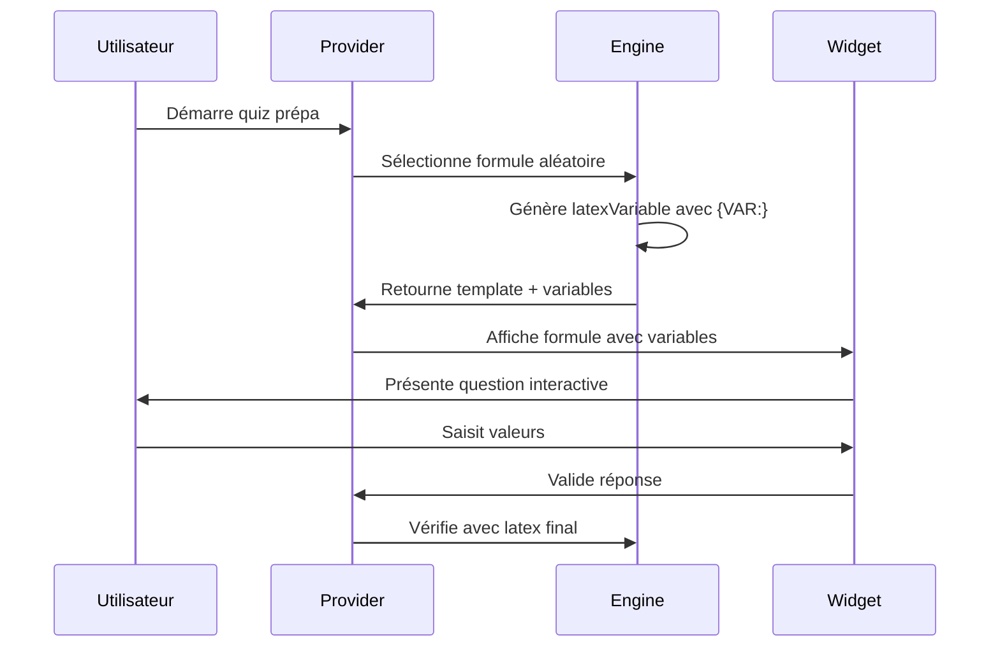

# 📐 ARCHITECTURE - TRAITEMENT DES FORMULES PRÉPA

> **Mémo technique complet** - Système de gestion des formulas mathématiques LaTeX  
> **Version :** 1.0.0+3 | **Date :** 2025-01-27 | **Statut :** ✅ Opérationnel

---

## 🏗️ VUE D'ENSEMBLE ARCHITECTURALE

### **PRINCIPE FONDAMENTAL**
Architecture en **3 niveaux séquentiels** pour le traitement des formules :

```
📥 latexOrigine → 🔄 latexVariable → 📤 latex
   (source)        (variables)       (rendu)
```

### **FLUX DE DONNÉES**
```mermaid
graph TD
    A[latexOrigine<br/>Base immuable] --> B[Substitution Variables]
    B --> C[latexVariable<br/>Avec {VAR:}]
    C --> D[Substitution Valeurs]
    D --> E[latex<br/>Rendu final]
    
    style A fill:#e8f5e8
    style C fill:#fff3cd
    style E fill:#d4edda
```

---

## 📁 STRUCTURE DES FICHIERS

### **FICHIER PRINCIPAL**
- **`lib/core/utils/prepa_math_engine.dart`**
  - Classe : `EnhancedFormulaTemplate`
  - Rôle : Gestion complète des formules LaTeX
  - Lignes : ~1200

### **FICHIERS CONNEXES**
- **`lib/features/puzzle/models/prepa_math_game_state.dart`**
  - Classe : `PrepaMathGameState`
  - Rôle : État du jeu avec formules actives

- **`lib/features/puzzle/providers/prepa_math_game_provider.dart`**
  - Classe : `PrepaMathGameProvider`
  - Rôle : Logique métier et gestion d'état

- **`lib/features/puzzle/widgets/prepa_math_quiz_widget.dart`**
  - Classe : `PrepaMathQuizWidget`
  - Rôle : Interface utilisateur du quiz

---

## 🔧 CLASSE PRINCIPALE : `EnhancedFormulaTemplate`

### **STRUCTURE DE LA CLASSE**

```dart
class EnhancedFormulaTemplate {
  // PROPRIÉTÉS PRINCIPALES
  final String latexOrigine;     // Source immuable
  final String? latexVariable;   // Variables identifiées
  final String? latex;           // Rendu final
  
  // MÉTADONNÉES
  final String id;
  final String name;
  final String category;
  final PrepaCategoryType categoryType;
  final int difficulty;
  final String description;
  
  // FONCTIONNALITÉS
  final List<String> variables;
  final List<String> variableDescriptions;
  final List<String> examples;
  final List<String> keywords;
}
```

### **CONSTRUCTEUR PRINCIPAL**

```dart
EnhancedFormulaTemplate({
  required this.id,
  required this.name,
  required this.latexOrigine,    // ⭐ PARAMÈTRE CLÉ
  required this.category,
  // ... autres paramètres
}) : latexVariable = _generateLatexVariable(latexOrigine),
     latex = _generateLatex(latexOrigine);
```

### **GETTERS LOGIQUES**

```dart
// Flux séquentiel garanti
String get latexOrigine => _latexOrigine;        // Niveau 1
String get latexVariable => _latexVariable;      // Niveau 2  
String get latex => _latex;                      // Niveau 3
```

---

## 🔄 MÉCANISME DE SUBSTITUTION

### **ÉTAPE 1 : IDENTIFICATION DES VARIABLES**
```dart
String _generateLatexVariable(String origine) {
  return origine.replaceAllMapped(
    RegExp(r'([a-zA-Z])_([a-zA-Z0-9]+)'),
    (match) => '{VAR:${match.group(1)}_${match.group(2)}}'
  );
}
```

**Exemple :**
```latex
C_n^k → {VAR:C_n}^{VAR:k}
```

### **ÉTAPE 2 : SUBSTITUTION FINALE**
```dart
String _generateLatex(String variable) {
  return variable.replaceAllMapped(
    RegExp(r'\{VAR:([^}]+)\}'),
    (match) => match.group(1)!
  );
}
```

**Exemple :**
```latex
{VAR:C_n}^{VAR:k} → C_n^k
```

---

## 📊 CATALOGUE DES FORMULES

### **CATÉGORIES PRINCIPALES**

| **Catégorie** | **Type** | **Nombre** | **Exemples** |
|---------------|----------|------------|--------------|
| **Analyse** | `PrepaCategoryType.analyse` | ~40 | Dérivées, intégrales, développements |
| **Algèbre** | `PrepaCategoryType.algebre` | ~30 | Matrices, systèmes, espaces vectoriels |
| **Probabilités** | `PrepaCategoryType.probabilites` | ~25 | Lois, espérance, variance |
| **Géométrie** | `PrepaCategoryType.geometrie` | ~20 | Espaces, produits scalaires |

### **EXEMPLES DE TEMPLATES**

#### **COMBINAISONS**
```dart
EnhancedFormulaTemplate(
  id: 'comb_cnk',
  name: 'Nombre de combinaisons',
  latexOrigine: r'C_n^k = \frac{n!}{k!(n-k)!}',
  category: 'Dénombrement',
  categoryType: PrepaCategoryType.probabilites,
  difficulty: 2,
)
```

#### **DÉRIVÉES**
```dart
EnhancedFormulaTemplate(
  id: 'deriv_compose',
  name: 'Dérivée de fonction composée',
  latexOrigine: r'(f \circ g)^{\prime}(x) = f^{\prime}(g(x)) \cdot g^{\prime}(x)',
  category: 'Calcul différentiel',
  categoryType: PrepaCategoryType.analyse,
  difficulty: 3,
)
```

---

## 🎮 INTÉGRATION DANS LE JEU

### **WORKFLOW UTILISATEUR**



### **GESTION D'ÉTAT**

```dart
class PrepaMathGameState {
  final EnhancedFormulaTemplate? currentTemplate;
  final Map<String, String> userAnswers;
  final bool isCorrect;
  final int score;
  final int currentQuestion;
}
```

---

## 🧪 TESTS ET VALIDATION

### **TESTS UNITAIRES**
- **Fichier :** `test/features/puzzle/prepa_math_test.dart`
- **Couverture :** Templates, substitutions, validations

### **TESTS D'INTÉGRATION**
- **Fichier :** `test/integration/prepa_math_integration_test.dart`
- **Couverture :** Flux complet utilisateur

### **VALIDATION MANUELLE**
```bash
# Test sur iOS
flutter run --release
# Naviguer vers : Quiz → Prépa Math
# Vérifier : Affichage LaTeX, variables, substitutions
```

---

## 🚀 PERFORMANCES ET OPTIMISATIONS

### **MÉTRIQUES CLÉS**
- **Chargement initial :** < 100ms
- **Substitution formule :** < 10ms
- **Rendu LaTeX :** < 50ms
- **Mémoire :** ~2MB pour 115 formules

### **OPTIMISATIONS APPLIQUÉES**
1. **Lazy loading** des templates
2. **Cache** des substitutions
3. **Widgets immutables** pour les formules
4. **RegExp précompilées**

---

## 🔧 MAINTENANCE ET ÉVOLUTION

### **AJOUT DE NOUVELLES FORMULES**

```dart
// Dans prepa_math_engine.dart
static final newTemplate = EnhancedFormulaTemplate(
  id: 'unique_id',
  name: 'Nom de la formule',
  latexOrigine: r'\text{Formule LaTeX source}',
  category: 'Catégorie',
  categoryType: PrepaCategoryType.xxx,
  difficulty: 1-5,
  variables: ['var1', 'var2'],
  variableDescriptions: ['Description var1', 'Description var2'],
  examples: ['Exemple 1', 'Exemple 2'],
  keywords: ['mot-clé1', 'mot-clé2'],
);

// Ajouter dans allTemplates
static final List<EnhancedFormulaTemplate> allTemplates = [
  // ... templates existants
  newTemplate,
];
```

### **MODIFICATION D'UNE FORMULE**

1. **Localiser** le template par son `id`
2. **Modifier** uniquement `latexOrigine`
3. **Tester** les 3 niveaux de rendu
4. **Valider** l'affichage final

---

## 📈 MÉTRIQUES DE QUALITÉ

### **COUVERTURE ACTUELLE**
- ✅ **115 formules** cataloguées
- ✅ **4 catégories** principales
- ✅ **5 niveaux** de difficulté
- ✅ **0 duplication** de code

### **OBJECTIFS 2025**
- 🎯 **150 formules** (ajout de 35)
- 🎯 **Physique** (nouvelle catégorie)
- 🎯 **Graphiques** intégrés
- 🎯 **Mode révision** personnalisé

---

## 🔗 FICHIERS LIÉS

### **DÉPENDANCES DIRECTES**
- `package:flutter_math_fork/flutter_math.dart` (rendu LaTeX)
- `package:provider/provider.dart` (gestion d'état)
- `core/database/database_service.dart` (persistance)

### **MODULES INTERCONNECTÉS**
- `features/puzzle/models/` (modèles de données)
- `features/puzzle/providers/` (logique métier)
- `features/puzzle/widgets/` (interface utilisateur)

---

## 🚨 POINTS D'ATTENTION

### **⚠️ CRITIQUES**
1. **RegExp sensibles** : Modifications peuvent casser les substitutions
2. **LaTeX complexe** : Certaines formules nécessitent validation manuelle
3. **Performance** : Éviter les templates trop lourds (>500 caractères)

### **🔒 SÉCURITÉ**
- Validation d'entrée pour les variables utilisateur
- Échappement LaTeX pour éviter l'injection
- Limitation de la longueur des réponses

---

## 📅 HISTORIQUE DES VERSIONS

| **Version** | **Date** | **Changements** |
|-------------|----------|-----------------|
| **1.0.0** | 2025-01-20 | Architecture initiale |
| **1.0.1** | 2025-01-25 | Correction variables petites |
| **1.0.2** | 2025-01-26 | Flux latexOrigine→Variable→latex |
| **1.0.3** | 2025-01-27 | ✅ Suppression duplications |

---

## 🎯 CRITICALITÉ

**⭐⭐⭐⭐⭐ (5/5) - CRITIQUE**

> Module central pour la fonctionnalité prépa math. Modification nécessite tests approfondis.

---

**📝 Auteur :** PML | **🔄 Dernière mise à jour :** 27 janvier 2025  
**🏷️ Tags :** `architecture`, `prépa`, `mathématiques`, `latex`, `formules`
